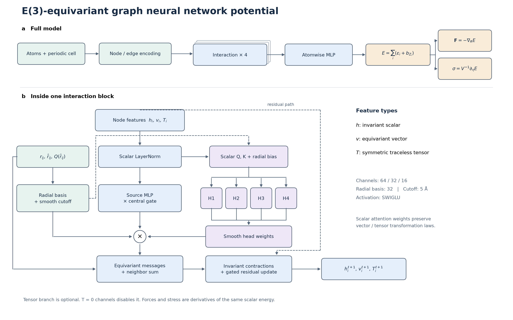
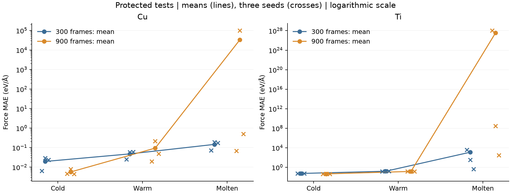
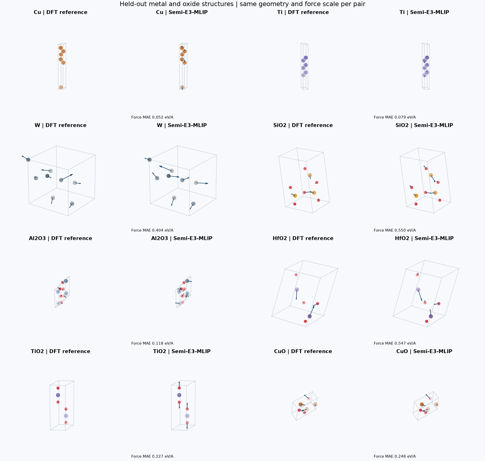
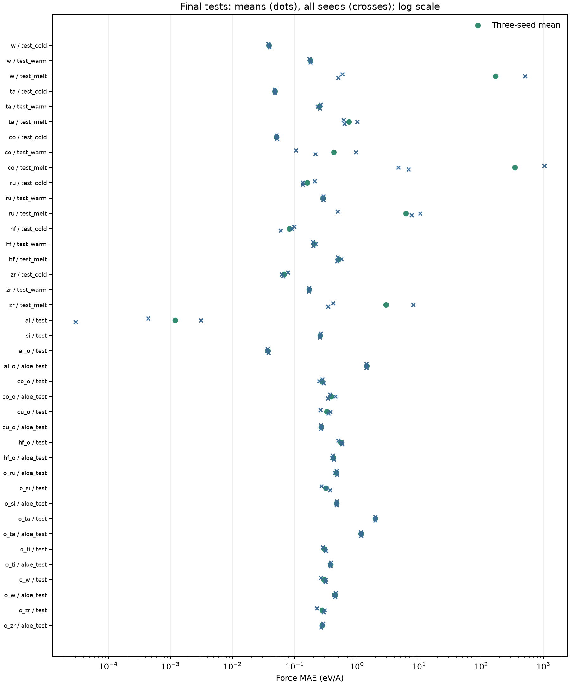

<div align="center">

# Semi-E3-MLIP

**Conservative E(3)-equivariant interatomic potentials for metals and metal oxides**

PyTorch from scratch · Energy-derived forces · Periodic structures · Reproducible benchmarks

[Results](docs/results.md) · [Quick start](#quick-start) · [Model & physics](docs/attention.md) · [Data](docs/aimd_expansion.md) · [Reproduce](docs/usage.md)

</div>



Semi-E3-MLIP is a research codebase for learning potential-energy surfaces across
semiconductor-relevant materials. It implements scalar, vector, and optional
rank-two tensor features; gated or smooth-attention message passing; and
conservative forces and stress from a learned total energy. It uses PyTorch
without ASE, e3nn, PyG, or pretrained MLIP weights.

**Status:** Training and evaluation complete for the recorded study. Repository visibility: public.
The broad model is a research baseline, not a validated production MD potential.

## Materials at a glance

| Family | Included chemical systems |
| --- | --- |
| Elemental metals and silicon | Al, Co, Cu, Hf, Ru, Si, Ta, Ti, W, Zr |
| Oxides | Al-O, Co-O, Cu-O, Hf-O, Ru-O, Si-O, Ta-O, Ti-O, W-O, Zr-O |
| Controlled temperature-transfer study | Separate Cu and Ti models, 300/900 cold frames, three seeds |
| Verified continuous AIMD comparison | Three Si surface trajectories, 216 atoms, 300 K, 500 fs |

The broad training set contains **3,156 configurations across 20 chemical systems**.
Coverage varies greatly by material and does not imply arbitrary alloy/interface
support. Per-system counts, errors, and missing test coverage are explicit in
[the material results](docs/results.md#multi-metal--metal-oxide-model).

## Dataset distributions


The partitions are shown separately. Composition-adjusted energies subtract
training-only elemental offsets; force distributions retain their high-force tails.
[Per-system distributions, weighting, and numerical quantiles](docs/results.md#dataset-distributions).

## Measured train and test results

The same frozen, validation-selected multi-material checkpoint is used throughout
this table and the external silicon comparison.

| Partition | Frames | Energy MAE (meV/atom) | Force MAE (eV/A) |
| --- | --- | --- | --- |
| Expanded training | 3156 | 52.649 | 0.091 |
| MatPES validation | 145 | 103.966 | 0.231 |
| MatPES test | 122 | 92.189 | 0.304 |
| MP-ALOE oxide test | 279 | 72.259 | 0.228 |

The test errors remain above the original 10 meV/atom and 0.1 eV/A targets.
Ta-containing test configurations are a prominent failure case; aggregate
performance must not be interpreted as uniform accuracy across materials.


### Controlled Cu/Ti study

**Molten-phase transfer fails severely for several fits.** All seed results, including extreme finite predictions, are retained. These models are not suitable for molten MD on the evidence shown here.

| Material | Train frames | Train | Validation | Cold test | Warm test | Molten test |
| --- | --- | --- | --- | --- | --- | --- |
| Cu | 300 | 0.020 +/- 0.012 | 0.046 +/- 0.018 | 0.020 +/- 0.012 | 0.048 +/- 0.019 | 0.146 +/- 0.064 |
| Cu | 900 | 0.006 +/- 0.002 | 0.027 +/- 0.007 | 0.006 +/- 0.002 | 0.094 +/- 0.106 | 3.350e+04 +/- 5.802e+04 |
| Ti | 300 | 0.053 +/- 0.001 | 0.153 +/- 0.008 | 0.054 +/- 0.001 | 0.152 +/- 0.008 | 1220.576 +/- 2086.569 |
| Ti | 900 | 0.043 +/- 0.003 | 0.140 +/- 0.005 | 0.044 +/- 0.003 | 0.141 +/- 0.007 | 3.676e+27 +/- 6.367e+27 |

Force MAE in eV/A; mean +/- SD across three initialization seeds when complete.
Architecture selection uses warm validation only. See the [fixed experimental
protocol](docs/focused_experiments.md) for temperature definitions and correlated-frame limitations.



### AIMD versus model inference

| Reference case | Force frames | Force MAE (eV/A) | Force RMSE (eV/A) | Completed seeds | Failed seeds |
| --- | --- | --- | --- | --- | --- |
| Si 110 elong0.500 | 21 | 0.193 | 0.269 | 3 | 0 |
| Si 111 elong0.500 | 21 | 0.208 | 0.276 | 3 | 0 |
| Si 110 elong1.500 | 21 | 0.212 | 0.300 | 3 | 0 |


The animation compares a real **CP2K/PBE AIMD reference** with independent
**r2SCAN-trained model Langevin dynamics**. It shows cross-functional and surface
transfer, with different thermostats and unavailable reference velocities.
It is not a pointwise trajectory accuracy claim. [All cases, metrics, and
structural statistics](docs/results.md#external-aimd-comparison).

## Metal and oxide visualizations



Each pair uses the same held-out geometry, camera, and force-arrow scale.
Examples are selected by ID rather than error. These are static DFT comparisons;
they are not presented as continuous AIMD. [Force parity and complete metrics](docs/results.md) ? [Animated metal/oxide gallery](docs/gallery.md).

## Training loss and why we use it

The published shared model and current width experiments minimize a **scaled pseudo-Huber energy/force/stress loss**:

$$
\mathcal{L}=L_E+10L_F+L_\sigma,\qquad
\rho_\delta(x)=2\delta^2\left(\sqrt{1+(x/\delta)^2}-1\right),\quad\delta=1.
$$

For a batch of $B$ structures with $N_b$ atoms, the three terms are:

$$
L_E=\frac1B\sum_b\rho_1\!\left(\frac{\hat E_b-E_b}{N_b s_E}\right),\qquad
L_F=\frac1B\sum_b\frac1{3N_b}\sum_{i,\alpha}\rho_1\!\left(\frac{\hat F_{bi\alpha}-F_{bi\alpha}}{s_F}\right),
$$

$$
L_\sigma=\frac1B\sum_{b\,{\rm with\ stress}}\frac19\sum_{\alpha,\beta}
\rho_1\!\left(\frac{\hat\sigma_{b\alpha\beta}-\sigma_{b\alpha\beta}}{s_\sigma}\right).
$$

The scales are fitted on **training data only**, and energies include training-fitted elemental offsets. For the published shared checkpoint, $s_E=1.08283$ eV/atom, $s_F=1.77834$ eV/Angstrom and $s_\sigma=0.127374$ eV/Angstrom$^3$. Missing stress labels contribute zero while retaining the full batch denominator. The independent material/Cu-Ti specialist studies use **energy/force/stress weights 1/10/0**. Auxiliary charge/magnetic losses are disabled in these reported fits.

**Why this loss:** per-atom energies and per-structure averaging keep large cells from dominating just because they contain more atoms. Training-derived scales make the terms dimensionless; the force weight emphasizes local derivatives needed for dynamics. Pseudo-Huber is quadratic near zero and approximately linear for large residuals, reducing extreme points' influence while remaining smooth. These are modeling choices, not demonstrated optimal weights. Robust loss can also underweight difficult high-force environments, so we report raw MAE/RMSE and examine molten and high-force errors separately. Forces and stress are obtained by differentiating the same predicted energy.

**Loss is not checkpoint selection.** The published baseline and width study select checkpoints by validation force MAE. This can retain a poor energy fit, so the separate physics/priority research track tests a balanced per-system energy/force validation score. It does not retroactively change the published results. [Implementation](semi_mlip/train.py) | [Frozen shared configuration](reports/aimd_comparison/selection.json)

## Quick start

Tested locally on Windows, Python 3.13, and an RTX 3070 Laptop GPU (8 GB).
CPU inference is also supported. Install a PyTorch build suited to your machine.

```powershell
python -m venv .venv
.\.venv\Scripts\python -m pip install torch numpy
.\.venv\Scripts\python -m pip install -e ".[test,visualize]"
.\.venv\Scripts\python -m pytest -q
```

```powershell
# Download and prepare the baseline data
.\.venv\Scripts\python -m semi_mlip download
.\.venv\Scripts\python -m semi_mlip prepare

# Train; checkpoints and data remain local
.\.venv\Scripts\python -m semi_mlip train --run runs/pilot --epochs 50

# Predict energy, forces, and stress from a local checkpoint
.\.venv\Scripts\python -m semi_mlip predict --checkpoint runs/pilot/best.pt --structure examples/silicon.json --output runs/prediction.json
```

The import remains `semi_mlip`; command aliases are `semi-e3-mlip` and `semi-mlip`.
[Detailed setup, checkpoint resumption, relaxation, and MD](docs/usage.md).
The MP-ALOE v2 archive is already used in the expanded training set. Reproduce its
checksum-verified acquisition with `python scripts/download_mpaloe.py`, then use
`device_subset.py` and `prepare_mpaloe.py` after baseline preparation. The source
is [MP-ALOE on Figshare](https://doi.org/10.6084/m9.figshare.29452190.v2), licensed
CC BY 4.0; see the [import audit](reports/mpaloe_merge.json) for grouping and counts.
Pretrained source-model weights are not used. [MP-ALOE coverage and expansion audit](docs/mpaloe.md).

Raw datasets and checkpoint binaries are excluded from Git; cloning the repository
does not download trained weights. Dataset acquisition scripts and source manifests
are versioned separately from the source archives.

## Repository guide

| Path | Purpose |
| --- | --- |
| `semi_mlip/` | Model, periodic graphs, training, inference, relaxation, and MD |
| `scripts/` | Data audits, experiment runners, benchmarks, and report generation |
| `tests/` | Symmetries, derivatives, splitting, resume, integrators, and analysis |
| `docs/` | Physics, protocols, data provenance, results, and curated figures |
| `reports/` | Machine-readable audits, metrics, and checkpoint/data hashes |
| `examples/` | Minimal structure inputs |
| `data/`, `runs/` | Local-only datasets, checkpoints, histories, and trajectories |

[Script guide](scripts/README.md) · [Documentation index](docs/README.md) · [Experiment versioning](docs/versioning.md)

## Scientific boundaries

- E(3) equivariance, conservative forces, and energy conservation are implementation
  properties; they do not guarantee DFT accuracy or chemical transferability.
- The current backbone has no long-range electrostatics, charge equilibration,
  spin degrees of freedom, or repulsive core. It is intended for small-cell research.
- Test subsets are small and uneven. Unknown chemical systems are rejected, but
  familiar elements do not make a new geometry in distribution.
- DFT functional, trajectory, temperature, and source differences are preserved in
  the reports. Short model-only MD checks and external AIMD comparisons are separate.

## Independent material studies

**Model scope:** these are independent specialist fits; the separate shared baseline uses one checkpoint for all 20 chemical systems. Current results do not validate general molten or metal/oxide-interface MD. [Suitability and complete coverage](docs/material_studies.md) | [Train/test parity gallery](docs/parity.md).

Separate models for six additional TM23 metals, elemental Al/Si, and ten oxide chemical systems: 18 studies and 54 fits. Each uses three initialization seeds and validation-only checkpoint selection.

[Full train/test results, distributions and learning curves](docs/material_studies.md). Al remains exploratory because its MatPES test contains only one frame. Known Cu/Ti molten-transfer failures remain documented above.



## Alloy transfer verification

The frozen shared model was tested without retraining on **2,421 previously unused r2SCAN configurations across six binary systems**. None meets both project energy/force targets. [Alloy errors, parity plots and phase-stability limits](docs/alloy_validation.md) explain why these results do not establish an equilibrium phase diagram.

[Model size, literature and research plan](docs/model_capacity.md) | [Continuous AIMD energy/force parity](docs/aimd_parity.md)

[Running 1x/2x/4x width study](docs/width_scaling.md) | [Replacement alloy references](docs/alloy_references.md)

[Physics research and Ru/Ta/Ti/Ta-O recovery experiments](docs/physics_research.md)
