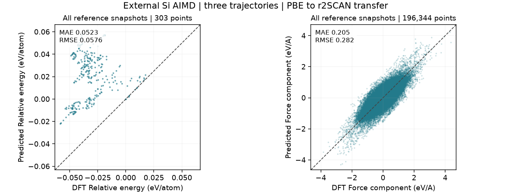
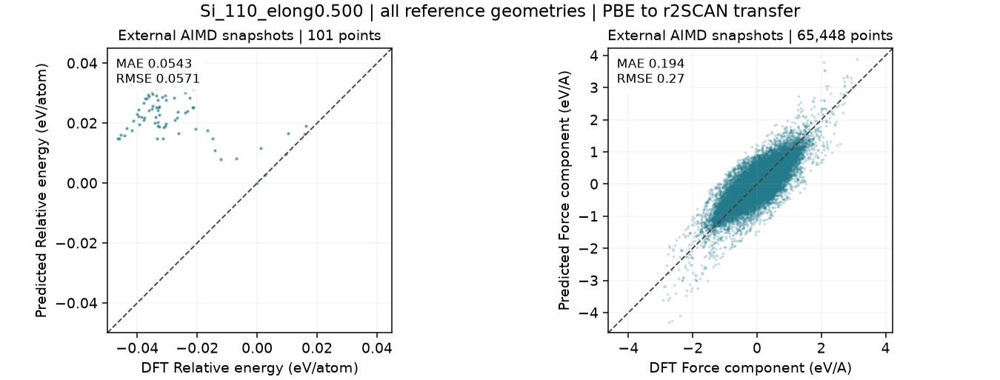
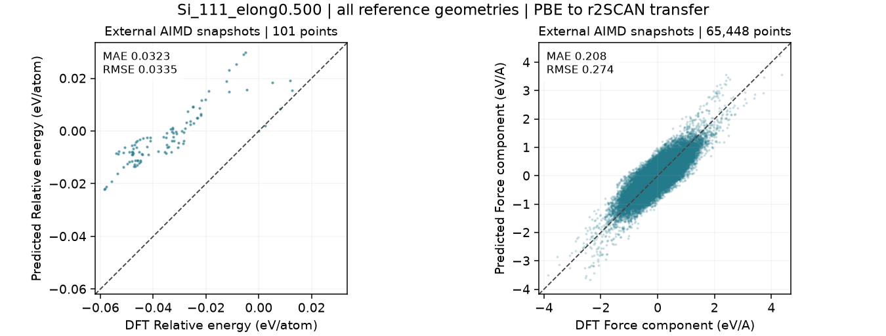
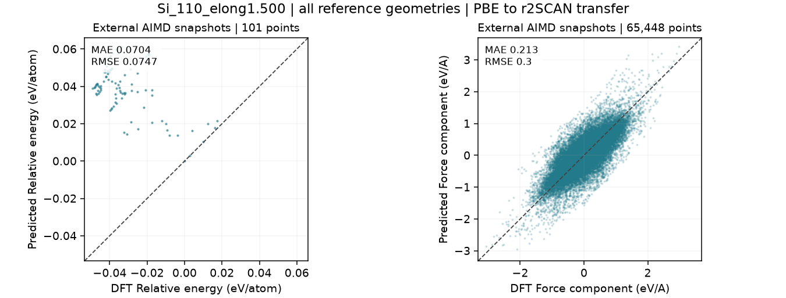

# AIMD reference parity

[Trajectory animations and structural statistics](results.md#external-aimd-comparison) | [All train/test parity](parity.md)

The frozen shared model is evaluated on **every stored reference geometry**: 101 frames per trajectory, 303 frames total, and 196,344 signed Cartesian force components. These are external tests, not training data. No predictions are compared between independently evolved trajectories.

**Energy convention:** each method is separately referenced to its own first-frame energy within each trajectory. The plot tests energy changes; it does not establish absolute energy agreement. The first point is zero by construction. Raw energy errors are retained in the report but have incompatible reference zeros. **CP2K/PBE reference versus r2SCAN model:** both force and relative-energy plots are cross-method transfer diagnostics.

[Overall PDF](assets/parity/aimd_overall.pdf)

## Each reference trajectory

### Si_110_elong0.500

[PDF](assets/parity/aimd_Si_110_elong0.500.pdf)

### Si_111_elong0.500

[PDF](assets/parity/aimd_Si_111_elong0.500.pdf)

### Si_110_elong1.500

[PDF](assets/parity/aimd_Si_110_elong1.500.pdf)

## Interpretation

The dashed line denotes agreement, not a fitted regression. MAE/RMSE include all plotted points. The earlier trajectory report evaluated every fifth stored frame; this report uses all frames, so the force numbers can differ. Temporal correlation means 303 frames are not 303 independent experiments. These 500 fs surface trajectories cannot establish diffusion or molten-metal suitability.

The existing [TM23 specialist parity figures](parity.md#independent-specialists) already compare cold, warm and molten AIMD-derived DFT snapshots. They are distinct from these verified continuous Si references and are not pooled with them.

[Metrics and frozen hashes](../reports/aimd_comparison/parity.json) | [Reference source](https://doi.org/10.6084/m9.figshare.29422061.v1)

Overall force MAE is **0.2050 eV/A**; relative-energy MAE is **52.32 meV/atom**. These discrepancies do not support a quantitative accuracy claim for these surfaces.
