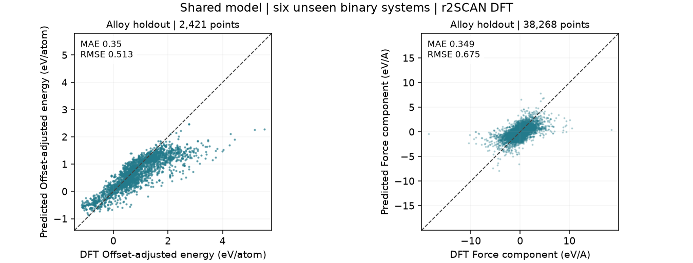
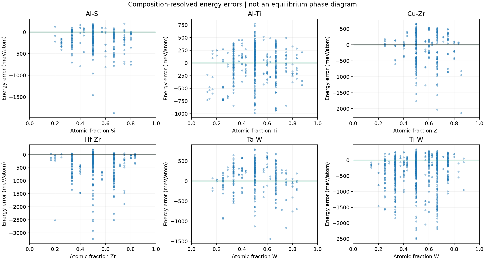

# Alloy verification and phase-stability limits

[Material suitability](material_studies.md) | [Train/test parity gallery](parity.md)

## What was tested

The existing shared checkpoint was evaluated without retraining on six binary chemistries absent from its elemental/oxide training and validation sets. All eligible, deduplicated configurations in the declared systems were used. These are off-equilibrium r2SCAN DFT snapshots from [MP-ALOE v2](https://doi.org/10.6084/m9.figshare.29452190.v2), not verified continuous alloy AIMD. The [source paper](https://www.nature.com/articles/s41524-025-01834-9) describes the dataset generation.

This is a chemistry-transfer test within the same dataset family, not an independent DFT-method benchmark. Model and chemistry scope were frozen before predictions. MP-derived records and exact duplicate geometries were excluded. No alloy labels entered training or selection.

| Binary system | Frames / parent groups | Energy MAE (meV/atom) | Force MAE / RMSE (eV/A) | Both project targets met? | Parity |
| --- | ---: | ---: | ---: | --- | --- |
| Al-Si | 228 / 71 | 227.49 | 0.293 / 0.571 | No | [PNG](assets/parity/alloy_al_si.png) / [PDF](assets/parity/alloy_al_si.pdf) |
| Al-Ti | 501 / 147 | 256.65 | 0.252 / 0.432 | No | [PNG](assets/parity/alloy_al_ti.png) / [PDF](assets/parity/alloy_al_ti.pdf) |
| Cu-Zr | 312 / 100 | 391.86 | 0.395 / 0.721 | No | [PNG](assets/parity/alloy_cu_zr.png) / [PDF](assets/parity/alloy_cu_zr.pdf) |
| Hf-Zr | 312 / 96 | 455.51 | 0.255 / 0.444 | No | [PNG](assets/parity/alloy_hf_zr.png) / [PDF](assets/parity/alloy_hf_zr.pdf) |
| Ta-W | 300 / 89 | 301.26 | 0.407 / 0.742 | No | [PNG](assets/parity/alloy_ta_w.png) / [PDF](assets/parity/alloy_ta_w.pdf) |
| Ti-W | 768 / 216 | 405.67 | 0.425 / 0.841 | No | [PNG](assets/parity/alloy_ti_w.png) / [PDF](assets/parity/alloy_ti_w.pdf) |

**Trivial-force baseline:** Al-Si: model 0.293 versus zero-force 0.462 eV/A; Al-Ti: model 0.252 versus zero-force 0.279 eV/A; Cu-Zr: model 0.395 versus zero-force 0.379 eV/A; Hf-Zr: model 0.255 versus zero-force 0.381 eV/A; Ta-W: model 0.407 versus zero-force 0.434 eV/A; Ti-W: model 0.425 versus zero-force 0.473 eV/A. Cu-Zr is worse than predicting zero forces; improvements over that baseline are limited for several other systems. This prevents interpreting a plausible-looking parity cloud as sufficient evidence of accuracy.

**0 of six systems meet both working targets** (10 meV/atom and 0.1 eV/A). Passing a snapshot test would still not validate long MD or phase stability. Large energy errors directly weaken a phase-energy claim; force accuracy alone cannot establish correct phase ordering.

## Can this validate a phase diagram?

**No equilibrium phase diagram is established by these records.** A zero-temperature convex-hull comparison needs consistently calculated, sufficiently relaxed competing structures over composition plus matched elemental ground-state references. This off-equilibrium subset does not certify that set. Taking its lowest sampled energies would produce a sample-dependent lower envelope, not a verified ground-state phase diagram.

For the distinction between a DFT formation-energy hull and a finite-temperature phase diagram, see the [Materials Project phase-diagram methodology](https://docs.materialsproject.org/methodology/materials-methodology/thermodynamic-stability/phase-diagrams-pds).

A finite-temperature phase diagram additionally needs free-energy differences, configurational/vibrational contributions, and sampling of relevant phases. Neither a static parity plot nor short energy-conserving MD supplies that evidence. The diagnostic below shows composition-dependent prediction bias; it is explicitly not a phase diagram.

Energy error is prediction minus DFT. The green band marks +/-10 meV/atom, the project screening target; it is not a phase boundary.

## Other alloy/AIMD references

- [Al-Si nucleation dataset](https://doi.org/10.24435/materialscloud:3h-sc): genuine AIMD-derived elemental and alloy configurations already audited locally, but LDA labels and unresolved text-unit confirmation prevent treating it as a directly matched r2SCAN validation set. Source-path overlap also requires grouped holdouts.
- [Al/Si interface data](https://github.com/krutarth24/Al-Si-DeePMD-NNP): PBE AIMD-derived interface snapshots; an interface is not a substitutional alloy phase diagram, and storage shards do not establish independent trajectories.

Next phase-stability work should use a dedicated matched-fidelity set of relaxed elemental and competing alloy structures, then compare formation energies, relative phase ordering and hull membership without fitting to those tests. First address any large errors found here.

[Frozen protocol, source counts, hashes and full metrics](../reports/alloy_validation).
