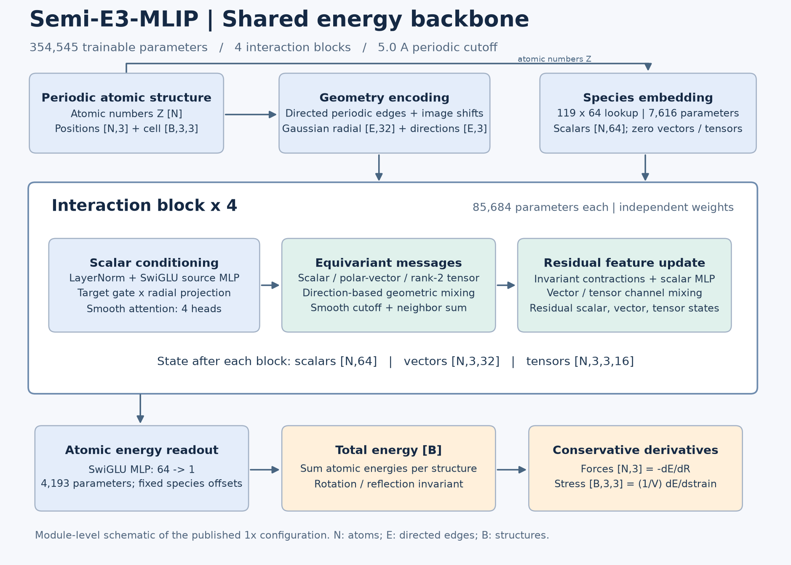

# Backbone inspection



The figure follows the overview-plus-block-detail approach of the
[user-provided architecture reference](https://user-images.githubusercontent.com/45628395/223023013-dfc0944c-8f43-4e8b-8633-341be131fba3.png),
with model-specific shapes and operations. It is an original module schematic,
not a trace generated by torchviz.

## Reproducible module summaries

[torchinfo](https://github.com/TylerYep/torchinfo) captures actual module calls on
one synthetic periodic structure: **3 atoms, 12 directed edges, one cell**.
Weights are freshly initialized on CPU; this inspects the published shared
configuration rather than measuring checkpoint accuracy. No training data or GPU
is used. The 1x configuration matches the published `expanded_tensor` model.
The wider configurations retain four blocks and 32 radial basis functions.

- [1x full module summary](../reports/architecture/torchinfo_1x.txt)
- [2x full module summary](../reports/architecture/torchinfo_2x.txt)
- [4x full module summary](../reports/architecture/torchinfo_4x.txt)
- [Configuration, module totals, package versions, and source hash](../reports/architecture/summary.json)

The wrapper calls `Potential.energy` directly, so the parent Potential/ModuleList
rows have no forward-call shapes. For tuple outputs, torchinfo displays the first
(scalar) output shape; each interaction also returns vector and tensor states as
shown in the schematic. Reused LayerNorm calls marked `(recursive)` share weights
within one block; the four separate blocks do not share weights. Library memory
and multiply-add estimates omit custom scatter/einsum work and force/stress
backward passes: they are **not MD throughput or training-memory benchmarks**.

## Inside one 1x interaction block

| Module | Dimensions | Parameters |
| --- | --- | ---: |
| Scalar LayerNorm | 64 channels; reused within block | 128 |
| Source SwiGLU MLP | Linear 64 -> 198; gate to 99; Linear 99 -> 160 | 28,870 |
| Target gate | Linear 64 -> 160 | 10,400 |
| Radial projection | Linear 32 -> 160 | 5,280 |
| Attention query + key | Two bias-free 64 -> 64 projections | 8,192 |
| Attention radial bias | Linear 32 -> 4 | 132 |
| Vector mix / a / b | Three bias-free 32 -> 32 projections | 3,072 |
| Tensor mix / a / b | Three bias-free 16 -> 16 projections | 768 |
| Scalar update SwiGLU MLP | Linear 112 -> 170; gate to 85; Linear 85 -> 112 | 28,842 |
| **Total per block** | Four independently parameterized blocks | **85,684** |

The 160 message channels split into 64 scalar, two sets of 32 vector, and two
sets of 16 tensor coefficients. Scalar updates use invariant vector/tensor
contractions. Rank-two features carry Cartesian `[3,3]` components per channel;
this should not be read as a claim of arbitrary higher-order angular capacity.
The energy readout is Linear 64 -> 64, SwiGLU to 32, then Linear 32 -> 1.
Elemental energy offsets and radial centers are fixed buffers, not trainable
parameters. Only supported training species are validated: 119 embedding entries
do not imply coverage of every chemical element.

## Autograd graph and regeneration

The [actual energy autograd graph](../reports/architecture/backbone_autograd.dot)
is generated by [torchviz](https://github.com/szagoruyko/pytorchviz) from
`make_dot(energy, params=...)`. It includes named trainable tensors and positions,
and covers the energy computation with fixed discrete neighbor connectivity.
It does not trace the additional force/stress differentiation. Node identifiers
can change between executions. The full operation graph is much larger than the
README schematic.

```bash
pip install -e ".[inspect]"
python -m scripts.summarize_backbone
```

The script asserts the 1x/2x/4x totals against direct parameter counting and checks
finite energy, force, and stress outputs with the expected shapes. It writes the
summary files, PNG/SVG schematic, and DOT graph. Native Graphviz `dot` is optional
and separate from the Python package; when on PATH, the script also renders the
full autograd SVG. Alternatively:

```bash
dot -Tsvg reports/architecture/backbone_autograd.dot -o backbone_autograd.svg
```

The experimental stability/core branch is a separate architecture variant and is
not represented by this published-baseline diagram. See
[physics research](physics_research.md) and [width scaling](width_scaling.md).
