# Metal and oxide visualization gallery

Static force animations show held-out configurations and camera motion, not continuous AIMD. Each pair shares geometry and force-arrow scale. Model-only MD panels use identical initial positions/velocities at two timesteps. Numerical stability is separate from DFT accuracy.

[Complete quantitative results](results.md) | [Real external AIMD comparisons](results.md#external-aimd-comparison)

## Silicon

Selected-example mean force MAE: 0.242 eV/A.

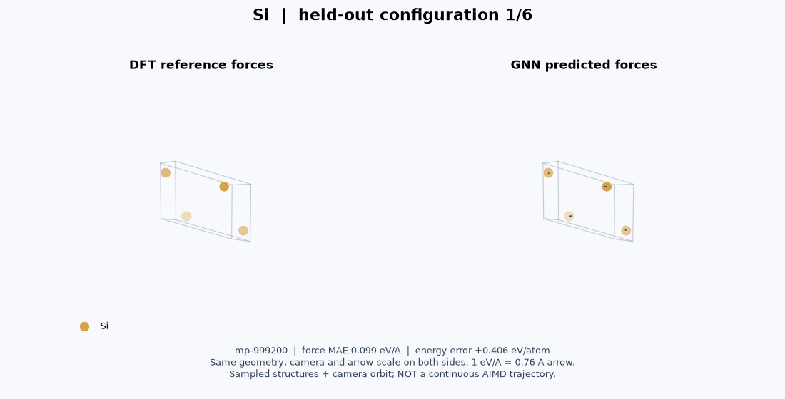

Model-only NVE timestep comparison (100 fs; not AIMD):

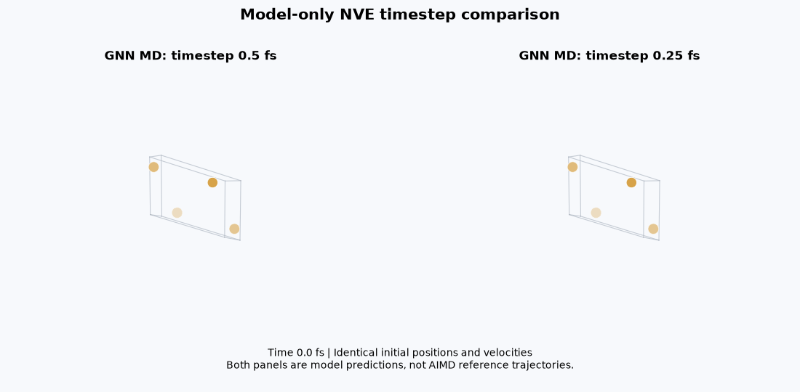

## Copper

Selected-example mean force MAE: 0.052 eV/A.

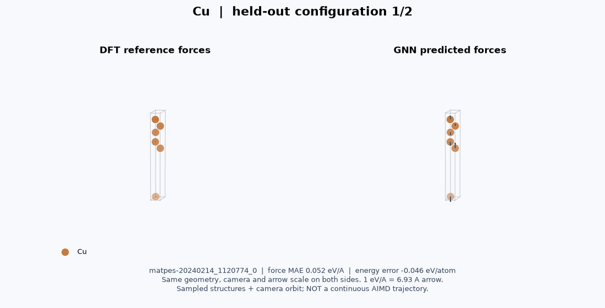

Model-only NVE timestep comparison (100 fs; not AIMD):

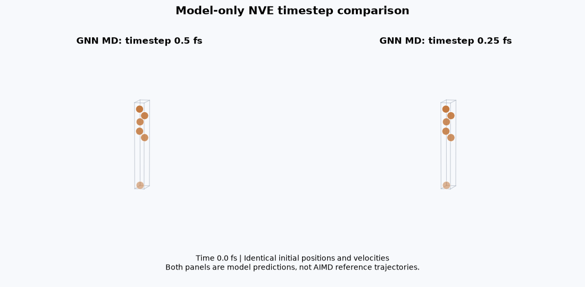

## Silica

Selected-example mean force MAE: 0.047 eV/A.

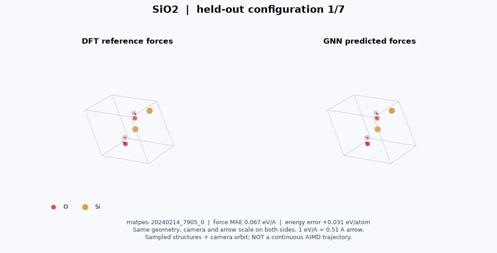

Model-only NVE timestep comparison (100 fs; not AIMD):

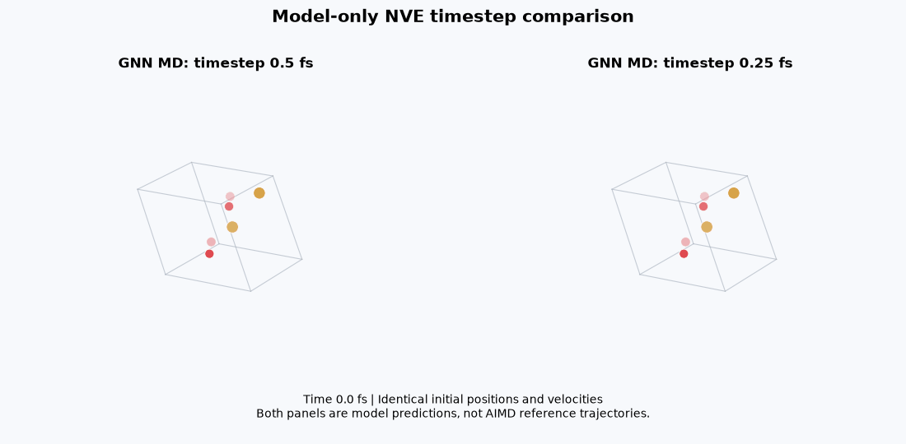

## Alumina

Selected-example mean force MAE: 0.319 eV/A.

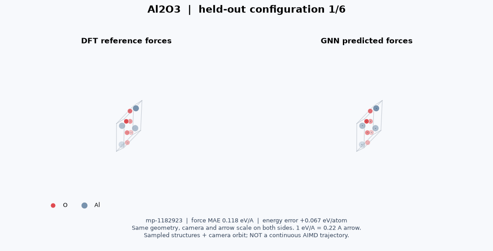

Model-only NVE timestep comparison (100 fs; not AIMD):

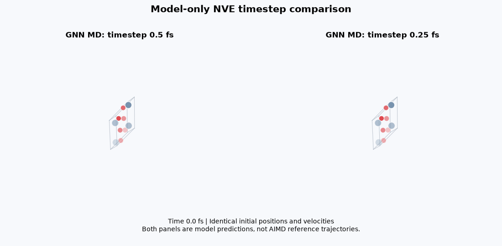

## Hafnia

Selected-example mean force MAE: 0.443 eV/A.

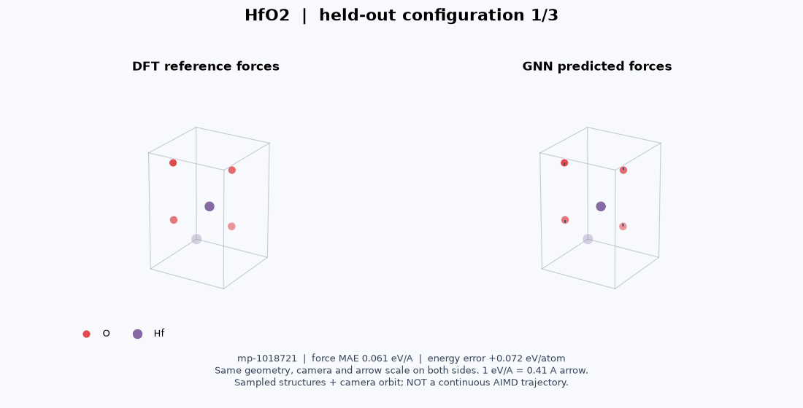

Model-only NVE timestep comparison (100 fs; not AIMD):

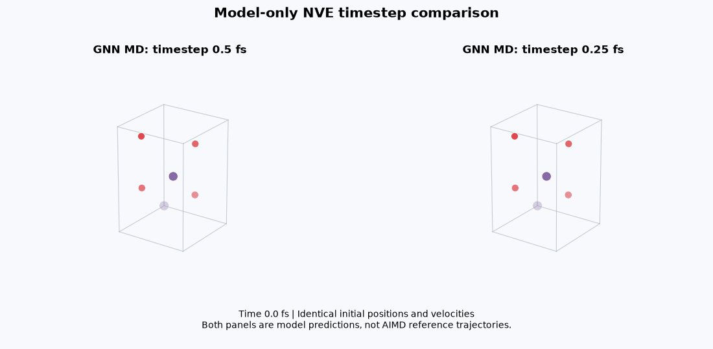

## Titania

Selected-example mean force MAE: 0.251 eV/A.

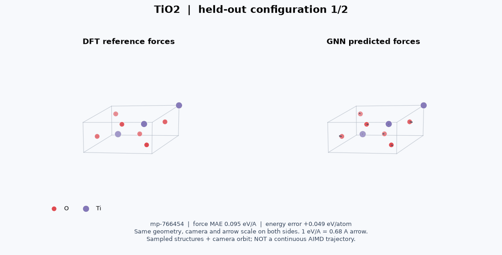

Model-only NVE timestep comparison (100 fs; not AIMD):

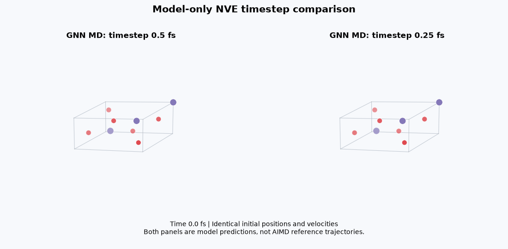

The smaller timestep reduced the total-energy range in five of six cases. Copper was slightly nonmonotonic: 2.733e-6 versus 2.992e-6 eV/atom at 0.5 and 0.25 fs. These short checks do not establish long-term stability.

[Exact structure IDs and plotting scales](../reports/visualizations/cases.json)
