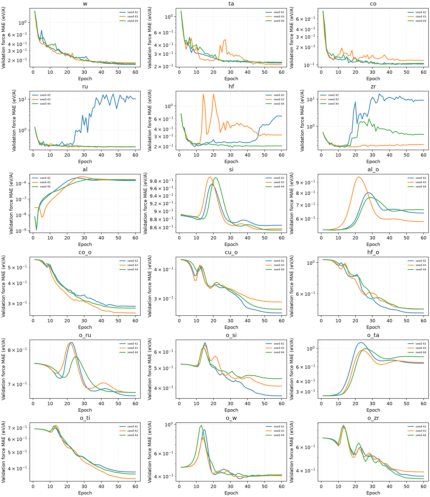
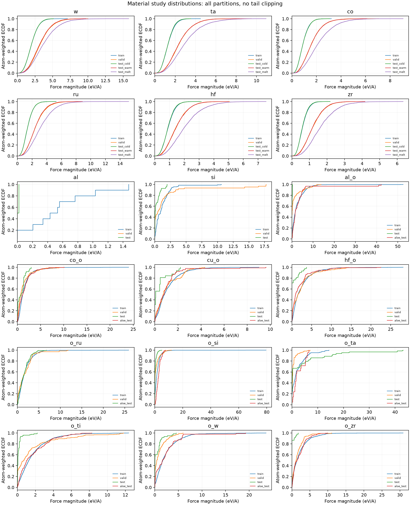

# Detailed specialist metrics

[Suitability and coverage](material_studies.md) | [Parity gallery](parity.md)

Fixed tensor models, 60 epochs, three initialization seeds per system. All values are mean +/- seed SD.

These follow-up studies preserve source partitions and DFT settings. Al remains exploratory because its test has one frame.

| Study | Split | Frames | Energy MAE (meV/atom) | Force MAE (eV/A) |
| --- | --- | ---: | ---: | ---: |
| tm23_w | train | 900 | 0.60 +/- 0.04 | 0.0381 +/- 0.0010 |
| tm23_w | valid | 90 | 3.07 +/- 0.43 | 0.1715 +/- 0.0059 |
| tm23_w | test_cold | 100 | 0.76 +/- 0.02 | 0.0386 +/- 0.0008 |
| tm23_w | test_warm | 100 | 3.20 +/- 0.23 | 0.1781 +/- 0.0051 |
| tm23_w | test_melt | 100 | 537.87 +/- 909.29 | 170.3806 +/- 294.1692 |
| tm23_ta | train | 900 | 0.95 +/- 0.58 | 0.0461 +/- 0.0006 |
| tm23_ta | valid | 90 | 4.97 +/- 0.49 | 0.2204 +/- 0.0075 |
| tm23_ta | test_cold | 100 | 0.98 +/- 0.49 | 0.0478 +/- 0.0005 |
| tm23_ta | test_warm | 100 | 8.98 +/- 0.33 | 0.2490 +/- 0.0149 |
| tm23_ta | test_melt | 100 | 22.29 +/- 6.80 | 0.7506 +/- 0.2257 |
| tm23_co | train | 900 | 1.56 +/- 1.05 | 0.0529 +/- 0.0006 |
| tm23_co | valid | 90 | 3.39 +/- 0.60 | 0.1076 +/- 0.0089 |
| tm23_co | test_cold | 100 | 1.59 +/- 1.18 | 0.0511 +/- 0.0007 |
| tm23_co | test_warm | 100 | 8.11 +/- 6.39 | 0.4269 +/- 0.4675 |
| tm23_co | test_melt | 100 | 618.95 +/- 981.96 | 348.6403 +/- 593.9660 |
| tm23_ru | train | 900 | 14.38 +/- 19.83 | 0.1578 +/- 0.0477 |
| tm23_ru | valid | 90 | 25.04 +/- 9.69 | 0.2844 +/- 0.0075 |
| tm23_ru | test_cold | 100 | 14.72 +/- 20.26 | 0.1595 +/- 0.0437 |
| tm23_ru | test_warm | 100 | 25.00 +/- 14.09 | 0.2865 +/- 0.0057 |
| tm23_ru | test_melt | 100 | 92.85 +/- 38.37 | 6.1834 +/- 5.1391 |
| tm23_hf | train | 900 | 8.43 +/- 5.33 | 0.0809 +/- 0.0218 |
| tm23_hf | valid | 90 | 18.78 +/- 9.64 | 0.2014 +/- 0.0124 |
| tm23_hf | test_cold | 100 | 8.55 +/- 5.29 | 0.0823 +/- 0.0206 |
| tm23_hf | test_warm | 100 | 16.32 +/- 9.40 | 0.2042 +/- 0.0116 |
| tm23_hf | test_melt | 100 | 98.60 +/- 7.21 | 0.5111 +/- 0.0460 |
| tm23_zr | train | 900 | 11.09 +/- 3.56 | 0.0677 +/- 0.0084 |
| tm23_zr | valid | 90 | 11.67 +/- 3.94 | 0.1719 +/- 0.0019 |
| tm23_zr | test_cold | 100 | 11.04 +/- 3.53 | 0.0677 +/- 0.0085 |
| tm23_zr | test_warm | 100 | 11.43 +/- 4.03 | 0.1705 +/- 0.0021 |
| tm23_zr | test_melt | 100 | 106.31 +/- 68.83 | 2.9554 +/- 4.4609 |
| r2scan_al | train | 11 | 83.37 +/- 12.51 | 0.2488 +/- 0.0009 |
| r2scan_al | valid | 1 | 177.98 +/- 58.89 | 0.0000 +/- 0.0000 |
| r2scan_al | test | 1 | 123.98 +/- 56.38 | 0.0012 +/- 0.0017 |
| r2scan_si | train | 124 | 204.23 +/- 2.51 | 0.2576 +/- 0.0098 |
| r2scan_si | valid | 16 | 509.31 +/- 6.80 | 0.8572 +/- 0.0060 |
| r2scan_si | test | 15 | 462.30 +/- 2.35 | 0.2572 +/- 0.0046 |
| r2scan_al_o | train | 109 | 976.00 +/- 12.58 | 1.1446 +/- 0.0037 |
| r2scan_al_o | valid | 22 | 1005.75 +/- 91.85 | 0.5277 +/- 0.0005 |
| r2scan_al_o | test | 6 | 1320.46 +/- 114.07 | 0.0369 +/- 0.0010 |
| r2scan_al_o | aloe_test | 12 | 689.68 +/- 20.33 | 1.4319 +/- 0.0032 |
| r2scan_co_o | train | 384 | 128.86 +/- 9.28 | 0.2547 +/- 0.0094 |
| r2scan_co_o | valid | 60 | 121.71 +/- 24.02 | 0.2763 +/- 0.0133 |
| r2scan_co_o | test | 4 | 90.27 +/- 39.96 | 0.2716 +/- 0.0225 |
| r2scan_co_o | aloe_test | 42 | 164.25 +/- 17.77 | 0.3866 +/- 0.0552 |
| r2scan_cu_o | train | 326 | 156.89 +/- 5.99 | 0.2127 +/- 0.0081 |
| r2scan_cu_o | valid | 35 | 291.88 +/- 12.47 | 0.2732 +/- 0.0152 |
| r2scan_cu_o | test | 4 | 212.63 +/- 56.48 | 0.3266 +/- 0.0593 |
| r2scan_cu_o | aloe_test | 33 | 232.60 +/- 12.70 | 0.2661 +/- 0.0066 |
| r2scan_hf_o | train | 403 | 202.02 +/- 12.78 | 0.3320 +/- 0.0041 |
| r2scan_hf_o | valid | 50 | 324.43 +/- 18.85 | 0.4558 +/- 0.0167 |
| r2scan_hf_o | test | 5 | 249.49 +/- 14.92 | 0.5505 +/- 0.0425 |
| r2scan_hf_o | aloe_test | 45 | 220.36 +/- 18.72 | 0.4131 +/- 0.0117 |
| r2scan_o_ru | train | 219 | 242.86 +/- 13.59 | 0.5347 +/- 0.0174 |
| r2scan_o_ru | valid | 23 | 553.08 +/- 7.39 | 0.6746 +/- 0.0050 |
| r2scan_o_ru | aloe_test | 21 | 202.32 +/- 24.08 | 0.4659 +/- 0.0181 |
| r2scan_o_si | train | 277 | 215.99 +/- 3.44 | 0.4256 +/- 0.0249 |
| r2scan_o_si | valid | 56 | 269.22 +/- 12.52 | 0.4058 +/- 0.0387 |
| r2scan_o_si | test | 34 | 218.28 +/- 47.66 | 0.3187 +/- 0.0497 |
| r2scan_o_si | aloe_test | 24 | 305.01 +/- 11.96 | 0.4709 +/- 0.0039 |
| r2scan_o_ta | train | 29 | 757.40 +/- 6.68 | 1.1485 +/- 0.0004 |
| r2scan_o_ta | valid | 10 | 952.67 +/- 54.16 | 0.2658 +/- 0.0001 |
| r2scan_o_ta | test | 7 | 1338.06 +/- 34.12 | 1.9834 +/- 0.0003 |
| r2scan_o_ta | aloe_test | 3 | 391.29 +/- 20.03 | 1.1634 +/- 0.0003 |
| r2scan_o_ti | train | 444 | 201.69 +/- 11.51 | 0.3305 +/- 0.0185 |
| r2scan_o_ti | valid | 44 | 208.03 +/- 18.91 | 0.3652 +/- 0.0171 |
| r2scan_o_ti | test | 12 | 502.42 +/- 61.03 | 0.3025 +/- 0.0194 |
| r2scan_o_ti | aloe_test | 39 | 283.54 +/- 13.23 | 0.3766 +/- 0.0087 |
| r2scan_o_w | train | 192 | 278.09 +/- 4.45 | 0.5598 +/- 0.0286 |
| r2scan_o_w | valid | 32 | 357.81 +/- 60.34 | 0.3931 +/- 0.0087 |
| r2scan_o_w | test | 5 | 383.61 +/- 83.15 | 0.2958 +/- 0.0280 |
| r2scan_o_w | aloe_test | 18 | 465.69 +/- 47.93 | 0.4443 +/- 0.0136 |
| r2scan_o_zr | train | 363 | 187.19 +/- 5.88 | 0.2945 +/- 0.0111 |
| r2scan_o_zr | valid | 45 | 247.55 +/- 36.21 | 0.3660 +/- 0.0217 |
| r2scan_o_zr | test | 5 | 121.38 +/- 41.21 | 0.2746 +/- 0.0405 |
| r2scan_o_zr | aloe_test | 42 | 152.86 +/- 28.04 | 0.2769 +/- 0.0098 |

## Protocol limitations

- TM23 cold/warm tests share source trajectories with development data; molten is temperature transfer.
- r2SCAN test labels were previously reported for the broad baseline; these are fixed follow-up comparisons, not a fresh blind benchmark.
- Al has only 11 training frames and one MatPES test frame; exploratory only.
- Exact geometry and parent checks do not prove structural independence.
- Three initialization seeds measure fit variability, not independent dataset replicates.
- DFT families are trained separately; oxide chemical systems may include multiple stoichiometries.

Protocol, hashes, full metrics, and seed summaries: [reports/material_studies](../reports/material_studies).
