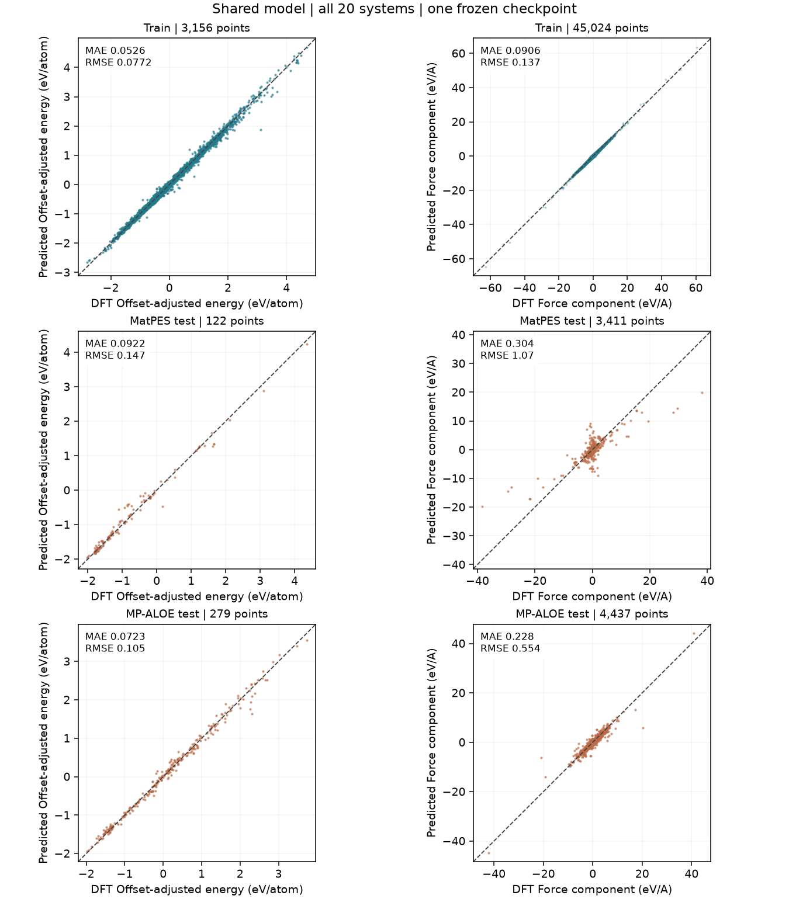

# Train and test parity plots

[Back to suitability and coverage](material_studies.md) | [Shared-model results](results.md)

## How to read these plots

Each figure separates training from held-out partitions and plots predicted against DFT energy and force. The dashed line is exact agreement. Every frame and force component is included; extreme predictions remain visible. Symmetric-log axes are explicitly labeled when needed to show severe failures. PNG previews and PDF downloads contain the same data.

Energies subtract training-fitted elemental offsets from both axes; this makes different compositions comparable without changing errors. Force panels use signed Cartesian components, not magnitudes. MAE and RMSE use all plotted points. Narrow or nearly zero-force test sets can look deceptively good; consult counts and the suitability assessment.

**Shared model:** one set of learned weights. **Specialists:** all three separate seeds are pooled in each panel, so reference points repeat three times. Predictions are not averaged; this is not one combined potential. PBE TM23 and r2SCAN specialist results are never pooled into a single overall score.

## Shared model: overall

[Download overall PDF](assets/parity/shared_overall.pdf)

## Shared model: each system

| Element | Elemental parity | Oxide parity |
| --- | --- | --- |
| Al | [PNG](assets/parity/shared_al.png) / [PDF](assets/parity/shared_al.pdf) | [PNG](assets/parity/shared_al_o.png) / [PDF](assets/parity/shared_al_o.pdf) |
| Si | [PNG](assets/parity/shared_si.png) / [PDF](assets/parity/shared_si.pdf) | [PNG](assets/parity/shared_o_si.png) / [PDF](assets/parity/shared_o_si.pdf) |
| Cu | [PNG](assets/parity/shared_cu.png) / [PDF](assets/parity/shared_cu.pdf) | [PNG](assets/parity/shared_cu_o.png) / [PDF](assets/parity/shared_cu_o.pdf) |
| Ti | [PNG](assets/parity/shared_ti.png) / [PDF](assets/parity/shared_ti.pdf) | [PNG](assets/parity/shared_o_ti.png) / [PDF](assets/parity/shared_o_ti.pdf) |
| W | [PNG](assets/parity/shared_w.png) / [PDF](assets/parity/shared_w.pdf) | [PNG](assets/parity/shared_o_w.png) / [PDF](assets/parity/shared_o_w.pdf) |
| Ta | [PNG](assets/parity/shared_ta.png) / [PDF](assets/parity/shared_ta.pdf) | [PNG](assets/parity/shared_o_ta.png) / [PDF](assets/parity/shared_o_ta.pdf) |
| Co | [PNG](assets/parity/shared_co.png) / [PDF](assets/parity/shared_co.pdf) | [PNG](assets/parity/shared_co_o.png) / [PDF](assets/parity/shared_co_o.pdf) |
| Ru | [PNG](assets/parity/shared_ru.png) / [PDF](assets/parity/shared_ru.pdf) | [PNG](assets/parity/shared_o_ru.png) / [PDF](assets/parity/shared_o_ru.pdf) |
| Hf | [PNG](assets/parity/shared_hf.png) / [PDF](assets/parity/shared_hf.pdf) | [PNG](assets/parity/shared_hf_o.png) / [PDF](assets/parity/shared_hf_o.pdf) |
| Zr | [PNG](assets/parity/shared_zr.png) / [PDF](assets/parity/shared_zr.pdf) | [PNG](assets/parity/shared_o_zr.png) / [PDF](assets/parity/shared_o_zr.pdf) |

## Independent specialists

The paired layout below is a navigation aid, not a claim that elemental and oxide checkpoints form one compatible potential. TM23/Cu-Ti specialists use PBE; these oxide and Al/Si specialists use r2SCAN.

| Element | Elemental specialist parity | Oxide specialist parity |
| --- | --- | --- |
| Al |  [PNG](assets/parity/specialist_r2scan_al.png) / [PDF](assets/parity/specialist_r2scan_al.pdf) |  [PNG](assets/parity/specialist_r2scan_al_o.png) / [PDF](assets/parity/specialist_r2scan_al_o.pdf) |
| Si |  [PNG](assets/parity/specialist_r2scan_si.png) / [PDF](assets/parity/specialist_r2scan_si.pdf) |  [PNG](assets/parity/specialist_r2scan_o_si.png) / [PDF](assets/parity/specialist_r2scan_o_si.pdf) |
| Cu | 300 frames: [PNG](assets/parity/specialist_focused_cu_n300.png) / [PDF](assets/parity/specialist_focused_cu_n300.pdf); 900 frames: [PNG](assets/parity/specialist_focused_cu_n900.png) / [PDF](assets/parity/specialist_focused_cu_n900.pdf) |  [PNG](assets/parity/specialist_r2scan_cu_o.png) / [PDF](assets/parity/specialist_r2scan_cu_o.pdf) |
| Ti | 300 frames: [PNG](assets/parity/specialist_focused_ti_n300.png) / [PDF](assets/parity/specialist_focused_ti_n300.pdf); 900 frames: [PNG](assets/parity/specialist_focused_ti_n900.png) / [PDF](assets/parity/specialist_focused_ti_n900.pdf) |  [PNG](assets/parity/specialist_r2scan_o_ti.png) / [PDF](assets/parity/specialist_r2scan_o_ti.pdf) |
| W |  [PNG](assets/parity/specialist_tm23_w.png) / [PDF](assets/parity/specialist_tm23_w.pdf) |  [PNG](assets/parity/specialist_r2scan_o_w.png) / [PDF](assets/parity/specialist_r2scan_o_w.pdf) |
| Ta |  [PNG](assets/parity/specialist_tm23_ta.png) / [PDF](assets/parity/specialist_tm23_ta.pdf) |  [PNG](assets/parity/specialist_r2scan_o_ta.png) / [PDF](assets/parity/specialist_r2scan_o_ta.pdf) |
| Co |  [PNG](assets/parity/specialist_tm23_co.png) / [PDF](assets/parity/specialist_tm23_co.pdf) |  [PNG](assets/parity/specialist_r2scan_co_o.png) / [PDF](assets/parity/specialist_r2scan_co_o.pdf) |
| Ru |  [PNG](assets/parity/specialist_tm23_ru.png) / [PDF](assets/parity/specialist_tm23_ru.pdf) |  [PNG](assets/parity/specialist_r2scan_o_ru.png) / [PDF](assets/parity/specialist_r2scan_o_ru.pdf) |
| Hf |  [PNG](assets/parity/specialist_tm23_hf.png) / [PDF](assets/parity/specialist_tm23_hf.pdf) |  [PNG](assets/parity/specialist_r2scan_hf_o.png) / [PDF](assets/parity/specialist_r2scan_hf_o.pdf) |
| Zr |  [PNG](assets/parity/specialist_tm23_zr.png) / [PDF](assets/parity/specialist_tm23_zr.pdf) |  [PNG](assets/parity/specialist_r2scan_o_zr.png) / [PDF](assets/parity/specialist_r2scan_o_zr.pdf) |

No elemental Ru shared-model test exists; its test panels explicitly show no records. Missing source partitions are not zero error.

[Numerical parity metrics, counts, checkpoint hashes and plotting conventions](../reports/parity/manifest.json).

## Alloy holdout verification

[Six additional binary systems: parity, errors and phase-stability limits](alloy_validation.md).

[Model size, literature and research plan](model_capacity.md) | [Continuous AIMD energy/force parity](aimd_parity.md)
