# Measured results

Generated from versioned JSON reports. Checkpoint selection uses validation only.

## Multi-metal / metal-oxide model

Frozen checkpoint: `runs\device\expanded_tensor\best.pt`. SHA-256:
`f2286fe10cf6c9218a78f463d1b19beff301d255eec62c633135cabc84cb5bcc`.

| Partition | Frames | Energy MAE (meV/atom) | Force MAE (eV/A) |
| --- | --- | --- | --- |
| Expanded training | 3156 | 52.649 | 0.091 |
| MatPES validation | 145 | 103.966 | 0.231 |
| MatPES test | 122 | 92.189 | 0.304 |
| MP-ALOE oxide test | 279 | 72.259 | 0.228 |

All force MAEs are averages over Cartesian force components. Energy MAE is per atom.
Training metrics use the selected checkpoint, not the last epoch. The expanded
training set includes MatPES and MP-ALOE data; their held-out sets remain separate.
The broad model does not meet the original 10 meV/atom / 0.1 eV/A test goals.

| Partition | Force RMSE (eV/A) | High-force MAE (eV/A) | Zero-force baseline MAE | Model / baseline |
| --- | --- | --- | --- | --- |
| train | 0.137 | 0.105 | 0.832 | 10.9% |
| validation | 0.665 | 0.633 | 0.284 | 81.3% |
| test | 1.072 | 1.115 | 0.376 | 80.8% |
| oxide_test | 0.554 | 0.305 | 0.832 | 27.4% |

High-force MAE includes Cartesian components of atoms whose reference force
magnitude exceeds 1 eV/A. Model/baseline is a force-MAE ratio, not an accuracy
percentage. The large MatPES test RMSE exposes a heavy error tail that MAE alone
would conceal.

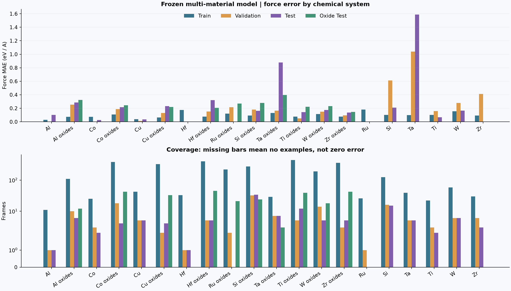

| System | Train / valid / test / oxide-test frames | Train force MAE | MatPES test force MAE | Oxide test force MAE |
| --- | --- | --- | --- | --- |
| Al | 11 / 1 / 1 / 0 | 0.030 | 0.102 | -- |
| Al oxides | 109 / 10 / 6 / 12 | 0.074 | 0.285 | 0.322 |
| Co | 25 / 3 / 2 / 0 | 0.072 | 0.027 | -- |
| Co oxides | 384 / 18 / 4 / 42 | 0.109 | 0.217 | 0.245 |
| Cu | 42 / 5 / 5 / 0 | 0.037 | 0.034 | -- |
| Cu oxides | 326 / 2 / 4 / 33 | 0.064 | 0.231 | 0.218 |
| Hf | 33 / 1 / 1 / 0 | 0.175 | 0.000 | -- |
| Hf oxides | 403 / 5 / 5 / 45 | 0.078 | 0.321 | 0.208 |
| Ru oxides | 219 / 2 / 0 / 21 | 0.121 | -- | 0.269 |
| Si oxides | 277 / 32 / 34 / 24 | 0.093 | 0.163 | 0.281 |
| Ta oxides | 29 / 7 / 7 / 3 | 0.129 | 0.878 | 0.396 |
| Ti oxides | 444 / 5 / 12 / 39 | 0.077 | 0.145 | 0.221 |
| W oxides | 192 / 14 / 5 / 18 | 0.115 | 0.174 | 0.231 |
| Zr oxides | 363 / 3 / 5 / 42 | 0.078 | 0.138 | 0.148 |
| Ru | 26 / 1 / 0 / 0 | 0.181 | -- | -- |
| Si | 124 / 16 / 15 / 0 | 0.100 | 0.211 | -- |
| Ta | 39 / 5 / 5 / 0 | 0.100 | 1.588 | -- |
| Ti | 22 / 3 / 2 / 0 | 0.102 | 0.068 | -- |
| W | 58 / 6 / 6 / 0 | 0.155 | 0.167 | -- |
| Zr | 30 / 6 / 3 / 0 | 0.091 | 0.004 | -- |

Errors are in eV/A. `--` means no test examples. Counts are frames, not independent
trajectories. Some systems have only one to five test structures. Ru and Ru oxides
lack MatPES test examples; Ru oxides have a separate MP-ALOE test partition.
A small elemental test error does not establish phase, defect, or temperature coverage.

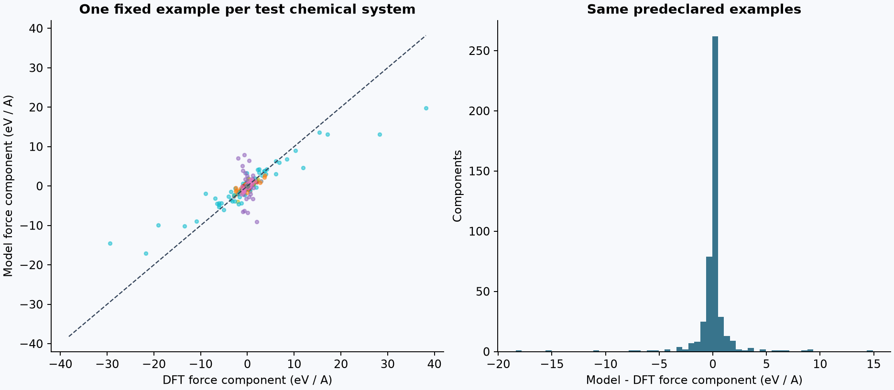

Parity plots use the lexicographically first held-out ID in each chemical system;
they are illustrations, not substitutes for all-frame errors above.

## Dataset distributions

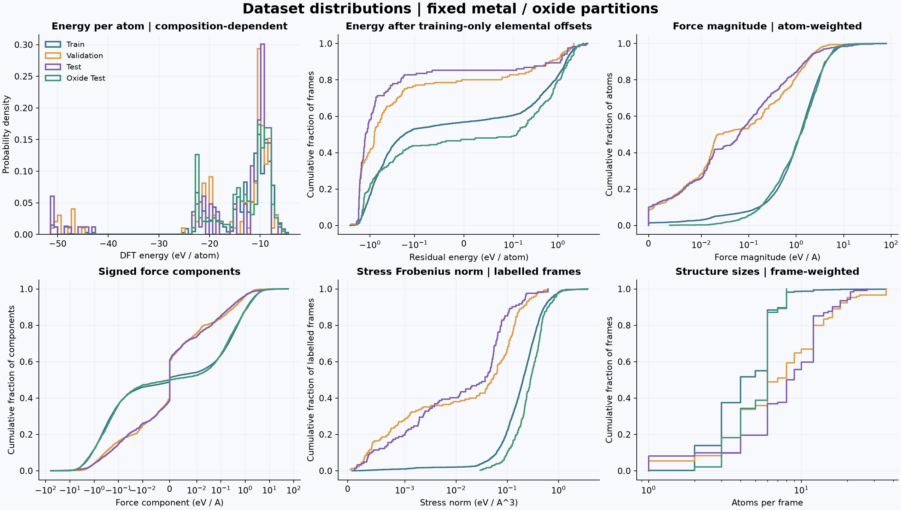

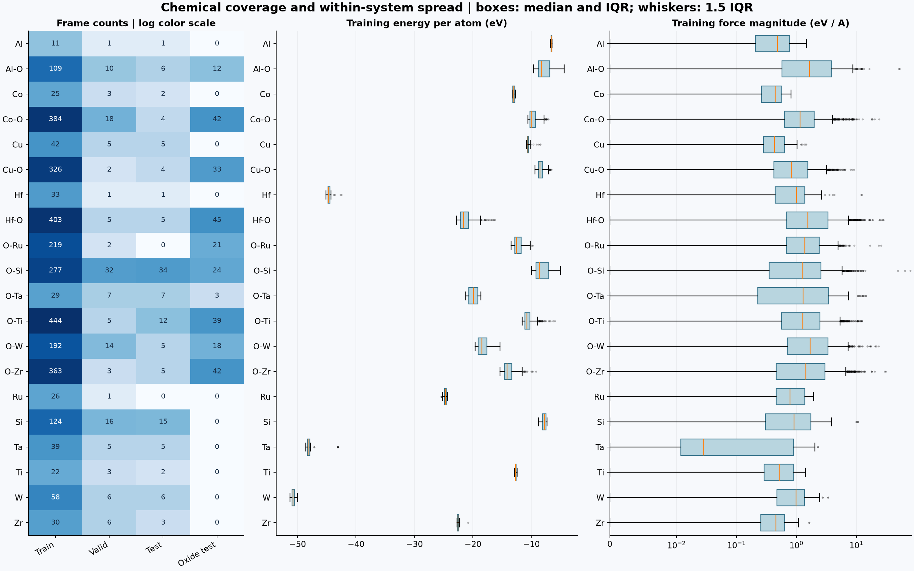

Energy, structure size and stress distributions weight each frame equally.
Force-magnitude curves weight atoms; component curves weight Cartesian components.
The energy residual subtracts elemental offsets fitted only to the training set.
Raw energies differ strongly by composition, so their pooled spread is not a
measure of structural diversity. The expanded training and MP-ALOE test sets
contain substantially stronger force/stress labels than the MatPES held-outs;
source and composition shifts must be considered alongside aggregate errors. ECDFs retain the full tails; the box plots show
median/IQR, 1.5-IQR whiskers, and outliers. Stress uses the Frobenius norm in eV/A^3;
unlabelled frames are excluded and counted in the numerical report.

[Exact quantiles, source counts, and input hashes](../reports/benchmark/dataset_distributions.json).

## Cu/Ti controlled temperature transfer

**Severe extrapolation failures:** several frozen fits produce enormous molten-test errors, reaching a three-seed mean of about 3.68e27 eV/A for Ti trained on 900 cold frames. Cold accuracy and short 300 K checks do not establish molten-phase validity. Every seed remains in the tables and logarithmic plot.

| Material | Architecture | Parameters | Warm validation force MAE (eV/A) |
| --- | --- | --- | --- |
| Cu | gated | 119,137 | 0.053 |
| Ti | gated | 119,137 | 0.176 |
| Cu | attention | 133,261 | 0.041 |
| Ti | attention | 133,261 | 0.184 |
| Cu | tensor | 146,785 | 0.025 |
| Ti | tensor | 146,785 | 0.145 |

Architecture screening uses 300 cold frames, 90 warm validation frames, seed 42,
and 60 epochs. Both materials selected the tensor model under the fixed 2% rule.
Architectures have unequal parameter counts. No test frames select the models.

| Material | Train frames | Train | Validation | Cold test | Warm test | Molten test |
| --- | --- | --- | --- | --- | --- | --- |
| Cu | 300 | 0.020 +/- 0.012 | 0.046 +/- 0.018 | 0.020 +/- 0.012 | 0.048 +/- 0.019 | 0.146 +/- 0.064 |
| Cu | 900 | 0.006 +/- 0.002 | 0.027 +/- 0.007 | 0.006 +/- 0.002 | 0.094 +/- 0.106 | 3.350e+04 +/- 5.802e+04 |
| Ti | 300 | 0.053 +/- 0.001 | 0.153 +/- 0.008 | 0.054 +/- 0.001 | 0.152 +/- 0.008 | 1220.576 +/- 2086.569 |
| Ti | 900 | 0.043 +/- 0.003 | 0.140 +/- 0.005 | 0.044 +/- 0.003 | 0.141 +/- 0.007 | 3.676e+27 +/- 6.367e+27 |

Force MAE in eV/A; mean +/- sample SD across three initialization seeds.

Selected-checkpoint energy MAE (meV/atom):

| Material | Train frames | Train | Validation | Cold test | Warm test | Molten test |
| --- | --- | --- | --- | --- | --- | --- |
| Cu | 300 | 6.032 +/- 8.697 | 7.013 +/- 8.923 | 6.031 +/- 8.755 | 7.080 +/- 9.156 | 15.863 +/- 14.959 |
| Cu | 900 | 0.196 +/- 0.263 | 0.813 +/- 0.366 | 0.208 +/- 0.273 | 1.384 +/- 0.769 | 2.090e+05 +/- 3.620e+05 |
| Ti | 300 | 0.707 +/- 0.041 | 5.248 +/- 0.688 | 0.719 +/- 0.079 | 5.065 +/- 0.984 | 5343.929 +/- 8892.424 |
| Ti | 900 | 1.558 +/- 0.911 | 3.769 +/- 0.290 | 1.615 +/- 0.938 | 3.397 +/- 0.229 | 7.488e+27 +/- 1.297e+28 |

Cold/warm train and test pools share source trajectories. Molten configurations
are a held-out temperature/trajectory shift. Seed variation is not independent-
dataset uncertainty. The 900-frame runs consume more optimizer updates than
300-frame runs, so this is an equal-epoch, not equal-compute, learning curve.

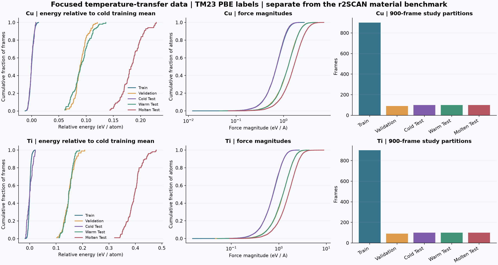

These distributions use TM23 PBE labels and remain separate from the r2SCAN
broad-model data. Energy is shifted by the cold-training mean only. The cold
300-frame cohort is nested within the plotted 900-frame cohort.

All initialization seeds (force metrics in eV/A):

| Material | Frames | Seed | Validation MAE | Cold MAE | Warm MAE | Molten MAE | Molten RMSE |
| --- | --- | --- | --- | --- | --- | --- | --- |
| Cu | 300 | 42 | 0.025 | 0.006 | 0.025 | 0.073 | 0.123 |
| Ti | 300 | 42 | 0.145 | 0.053 | 0.144 | 3629.871 | 9.484e+04 |
| Cu | 300 | 43 | 0.055 | 0.029 | 0.058 | 0.193 | 0.331 |
| Ti | 300 | 43 | 0.160 | 0.054 | 0.159 | 31.451 | 593.315 |
| Cu | 300 | 44 | 0.058 | 0.023 | 0.060 | 0.174 | 0.244 |
| Ti | 300 | 44 | 0.155 | 0.055 | 0.154 | 0.405 | 0.675 |
| Cu | 900 | 42 | 0.019 | 0.005 | 0.019 | 0.068 | 0.149 |
| Ti | 900 | 42 | 0.135 | 0.043 | 0.135 | 1.103e+28 | 5.926e+29 |
| Cu | 900 | 43 | 0.032 | 0.008 | 0.215 | 1.005e+05 | 4.160e+06 |
| Ti | 900 | 43 | 0.145 | 0.047 | 0.149 | 2.790e+08 | 9.463e+09 |
| Cu | 900 | 44 | 0.030 | 0.004 | 0.048 | 0.507 | 4.221 |
| Ti | 900 | 44 | 0.139 | 0.042 | 0.139 | 279.440 | 7459.988 |

[Measured training cost and parameter counts](../reports/focused/training_cost.json).
Epoch wall times include concurrent workloads and are not a controlled speed ranking.

## Numerical stability

| Model / timestep | Energy range (meV/atom) | Fitted drift (meV/atom/ps) |
| --- | --- | --- |
| cu_dt0.5 | 0.006 | -0.021 |
| cu_dt0.25 | 0.004 | -0.004 |
| ti_dt0.5 | 0.011 | -9.671e-04 |
| ti_dt0.25 | 0.007 | 0.003 |

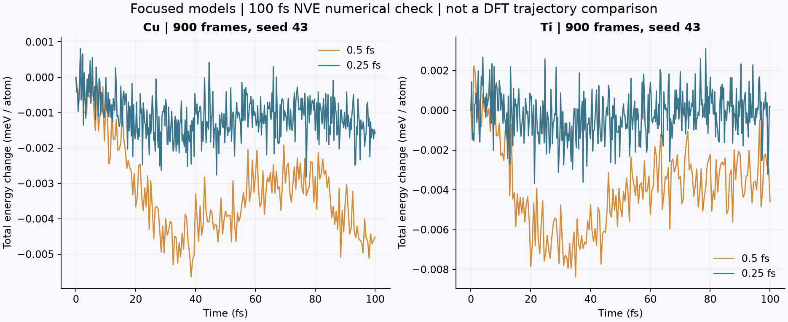

Broad-model metal and oxide checks:

| Material | Relaxed to tolerance | 0.5 fs NVE range (meV/atom) | 0.25 fs NVE range (meV/atom) |
| --- | --- | --- | --- |
| silicon | True | 0.009 | 0.003 |
| copper | True | 0.003 | 0.003 |
| silica | True | 0.036 | 0.010 |
| alumina | True | 0.012 | 0.005 |
| hafnia | True | 0.011 | 0.006 |
| titania | True | 0.006 | 0.004 |

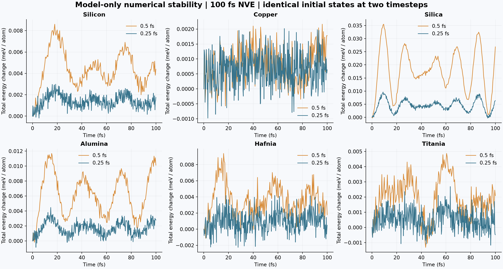

[Animated force and timestep comparisons](gallery.md).

These are 100 fs model-only NVE checks at 300 K initial velocities. They measure
integration behavior, not agreement with DFT trajectories. A short trace and a
small energy drift do not establish long-time stability.

## Inference timing

| Device | System | Atoms | Median (ms) | p10 / p90 (ms) |
| --- | --- | --- | --- | --- |
| cpu | Si | 8 | 16.451 | 15.36 / 18.40 |
| cpu | Cu | 6 | 24.182 | 19.72 / 31.76 |
| cpu | Ti | 6 | 28.874 | 19.35 / 35.51 |
| cpu | W | 8 | 33.677 | 28.76 / 39.33 |
| cpu | O-Si | 9 | 36.144 | 28.17 / 41.94 |
| cpu | Al-O | 10 | 49.526 | 40.56 / 57.85 |
| cpu | Hf-O | 6 | 18.994 | 16.02 / 29.91 |
| cpu | O-Ti | 6 | 19.868 | 16.24 / 27.88 |
| cpu | Si | 216 | 237.129 | 209.98 / 256.86 |
| cuda | Si | 8 | 32.875 | 31.05 / 35.53 |
| cuda | Cu | 6 | 36.586 | 33.15 / 45.45 |
| cuda | Ti | 6 | 32.771 | 29.92 / 37.13 |
| cuda | W | 8 | 32.444 | 30.29 / 35.12 |
| cuda | O-Si | 9 | 32.539 | 30.46 / 38.16 |
| cuda | Al-O | 10 | 34.132 | 32.01 / 36.92 |
| cuda | Hf-O | 6 | 31.961 | 28.61 / 36.13 |
| cuda | O-Ti | 6 | 32.281 | 29.01 / 35.85 |
| cuda | Si | 216 | 79.664 | 75.23 / 104.57 |

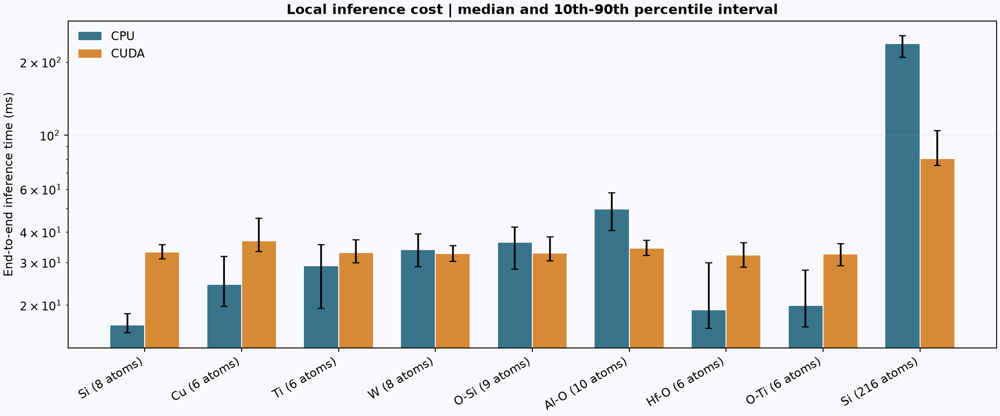

Batch size one; five warmups and 30 timed calls per structure. Timings include
neighbor enumeration, transfers, energy, forces, and stress. CPU and CUDA use the
same checkpoint. The examples include primitive test cells and a 216-atom Si
surface. This is a local benchmark, not a comparison against
MACE, NequIP, or other packages. Hardware and software are recorded in
[`inference.json`](../reports/benchmark/inference.json).

## External AIMD comparison

| Reference case | Force frames | Force MAE (eV/A) | Force RMSE (eV/A) | Completed seeds | Failed seeds |
| --- | --- | --- | --- | --- | --- |
| Si 110 elong0.500 | 21 | 0.193 | 0.269 | 3 | 0 |
| Si 111 elong0.500 | 21 | 0.208 | 0.276 | 3 | 0 |
| Si 110 elong1.500 | 21 | 0.212 | 0.300 | 3 | 0 |

Three 216-atom Si surface references at 300 K; 500 fs per reference and model run.
Each model case uses seeds 42/43/44, a 0.5 fs timestep, and Langevin dynamics.
Static force errors use every fifth stored reference frame (21 frames per case).
The reference uses CP2K/PBE and Nose-Hoover; this model uses r2SCAN training labels.
Initial velocities are unavailable, so trajectories start from the same geometry
with independent model velocities. These differences preclude a matched-Hamiltonian
accuracy claim or pointwise trajectory agreement claim.

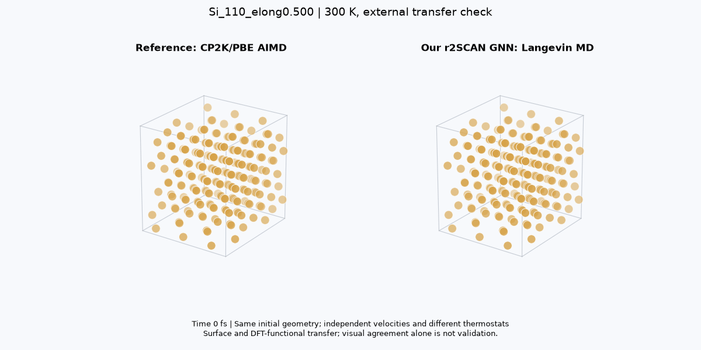

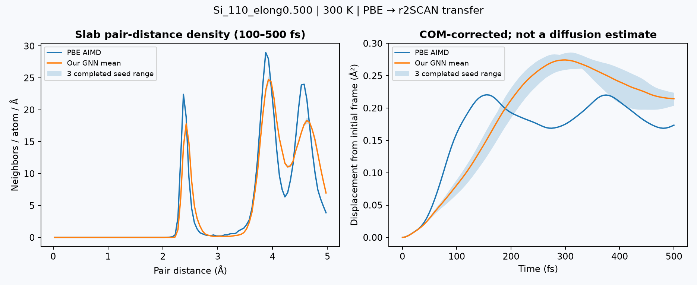
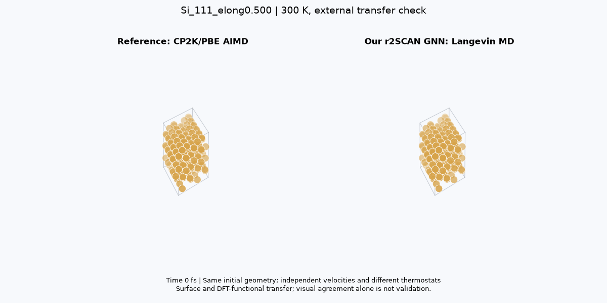

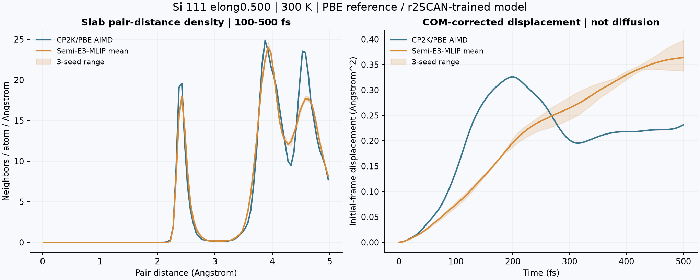
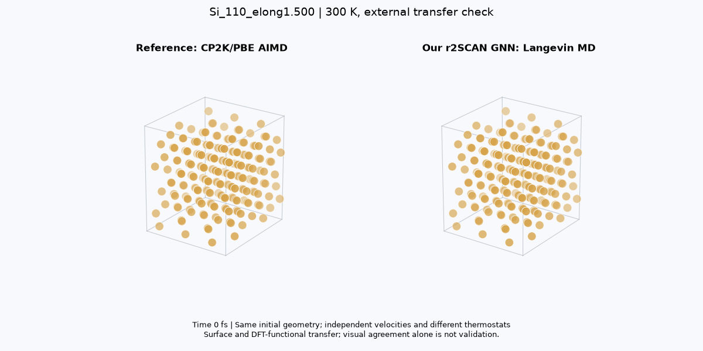

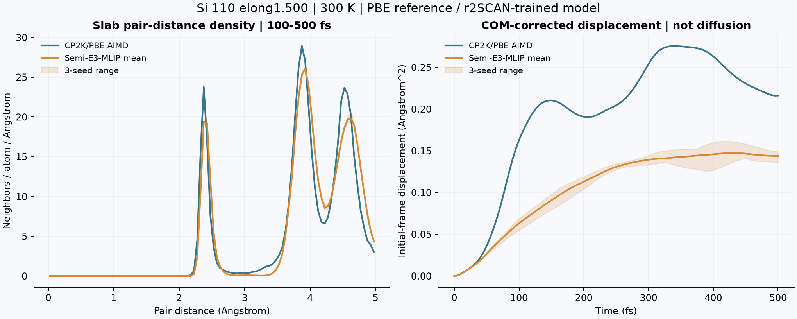

Pair-distance density is normalized per atom and distance, not by bulk density,
because these cells contain vacuum. Displacement is COM-corrected displacement
from the initial frame, not a time-origin averaged diffusion MSD. No diffusion
coefficient is inferred from 500 fs.

## Reproducibility

- [Focused protocol](focused_experiments.md), [frozen checkpoint hashes](../reports/focused/frozen.json).
- [Broad-model selection](../reports/aimd_comparison/selection.json), [benchmark data hashes](../reports/benchmark/protocol.json).
- [AIMD protocol and hashes](../reports/aimd_comparison/protocol.json), [source manifest](../reports/aimd_manifest.json).
- [Material results](../reports/benchmark/materials.json), [raw focused results](../reports/focused/tests.json).
- [Data acquisition and limitations](aimd_expansion.md), [simulation protocol](simulation_validation.md).
